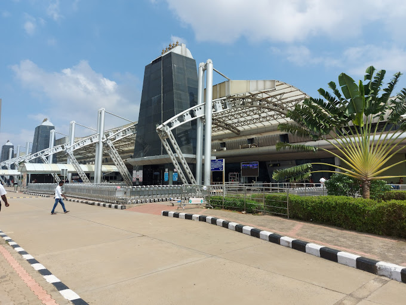
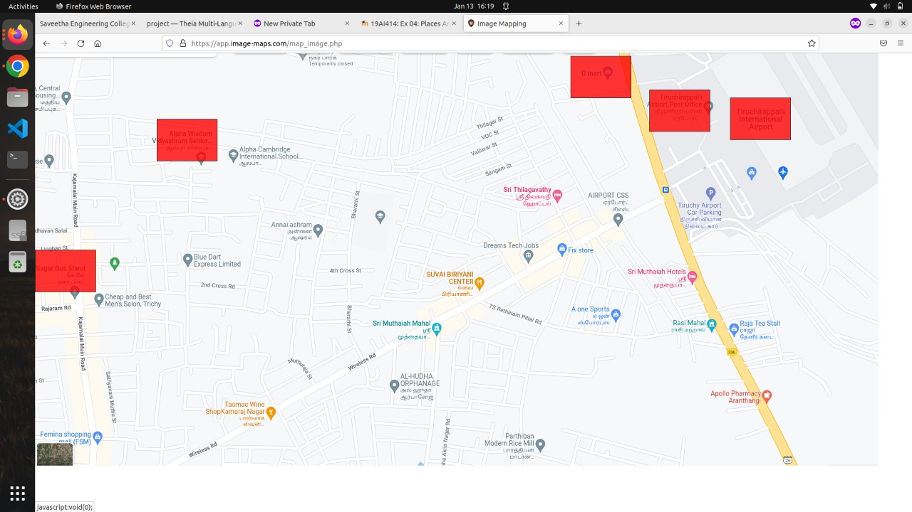
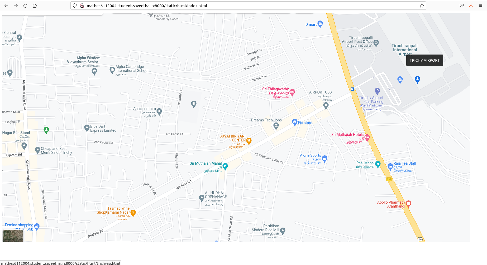

# Places Around Me
# Aim:
To develop a website to display details about the places around my house.

# Design Steps:
## Step 1:
Create a folder and clone tha repository in it.
## Step 2:
Create a folder named statis and on that create html folder and inside that creater
index.html
## Step 3:
Then go to maps and take a screenshot of your own. Then put in image mapping
and map a place to need.
## Step 4:
Get the code of the mapped place and put the code in index.html. Create some some
html files inside the index.html code.
## Step 5:
Now run the server. It will give the selected map and details of the marked place.
# Code:
#trichyap.html
```
<!DOCTYPE html>
<html>
    <head>
        <h1 align="center" >Tiruchirappalli International Airport </h1>
          <hr>
        <h4 align="center" > Tiruchirappalli International Airport is an international airport serving Tiruchirappalli in the Indian state of Tamil Nadu. The airport spread over an area of 702.02 acres is located on National Highway 336, about 5 km south of the city centre.</h4>
          <hr>
    </head>
    <body>
     
     <hr>
        
    </body>
</html>
```
# alpha.html
```
<!DOCTYPE html>
<html>
    <head>
        <h1 align="center" >Alpha Wisdom Vidyashram Senior Secondary School</h1>
          <hr>
        <h4 align="center" >Alpha Wisdom Vidyashram Senior Secondary School is the best international school in Trichy,</h4>
          <hr>
    </head>
    <body>
     
     <hr>
        
    </body>
</html>
```
# dmart.html
```
<!DOCTYPE html>
<html>
    <head>
        <h1 align="center" >D Mart</h1>
          <hr>
        <h4 align="center" >DMart, is an Indian retail corporation that operates a chain of hypermarkets in India.</h4>
          <hr>
    </head>
    <body>
     
     <hr>
        
    </body>
</html>
```
#busstand.html-
```
<!DOCTYPE html>
<html>
    <head>
        <h1 align="center" >KK NAGAR BUS STAND</h1>
          <hr>
        <h4 align="center" >The newly built bus terminus at K.K. Nagar in the city was declared open on Saturday, fulfilling a long-felt need of the local residents.</h4>
          <hr>
    </head>
    <body>
     
     <hr>
        
    </body>
</html>
```
# postoff.html
```
<!DOCTYPE html>
<html>
    <head>
        <h1 align="center">Tiruchirappalli Airport Post Office</h1>
    </head>
    <body>
      
      <br>
      
    </body>
</html>
```
# Output:
### Rect Mark place in Map:



### place around me trichy airport :




# Result:

